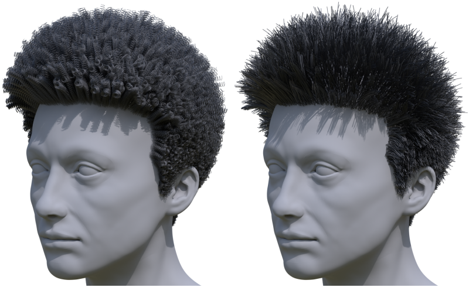

# Transforming Unstructured Hair Strands into Procedural Hair Grooms

<div align="center">
    
</div>

This repository contains the implementation for the SIGGRAPH 2025 paper [Transforming Unstructured Hair Strands into Procedural Hair Grooms](https://weschang.com/publications/iphg/).

## Setup

This code has been tested on Ubuntu 22.04 with an RTX 4090 GPU.
It requires an NVIDIA GPU with CUDA to run.

Install dependencies for nvdiffrast:
```bash
./setup_dependencies.sh
```

Using conda,
```bash
conda env create --file environment.yml
conda activate inverse_hair_grooming
```


## Running
Place examples in the `data` directory.

Run an example
```bash
python train-3d.py --dataset [example]
```

This will save to `output/[example]/[experiment number]` results including:
- Reference and final visualizations `reference.png` and `final.png`
- Checkpoints `stagen_*.pt`, `final.pt` and visualizations `stagen_*.png`
- Loss and parameter plots `training.png`

__Note:__ When running this project in a docker container on x86_64, you might encounter a `nvdiffrast` compilation error because the file `crt/host_config.h` cannot be found. This file and other missing dependencies are located in `$CONDA_ROOT/targets/x86_64-linux/include` instead of `$CONDA_ROOT/include`. We have found that copying or symlinking the missing files to `$CONDA_ROOT/include` fixes the issue.

## Creating examples

### Gaussian Haircut
1. Run Gaussian Haircut (GH): https://github.com/eth-ait/GaussianHaircut
2. Run the script to create the example:
    ```bash
    python scripts/create_example.py --type gh --in_dir [GH output]/[example name] --example [example]
    ```
3. Edit the example `scene-3d.py` file in `data/[example]_gh`.

### MonoHair
1. Get MonoHair (MH) data: https://github.com/KeyuWu-CS/MonoHair
2. Run the script to create the example:
    ```bash
    python scripts/create_example.py --type mh --in_dir [MH output]/[example name] --example [example]
    ```
3. Edit the example `scene-3d.py` file in `data/[example]_mh`

## Rendering results
Render results using Blender:
```bash
python scripts/render.py --blender_path [blender path] --dataset [example] --exp_num [experiment number] --view [view number]
```

This will save rendered images to `output/[example]/[experiment number]/images`.

## Editing grooms
Run `synthetic-grooms-coily` first, then see example in `scripts/editing.py`.
```bash
python train-3d.py --dataset synthetic-grooms-coily
python scripts/editing.py
```

This will save rendered images to `output/synthetic-grooms-coily/[last experiment number]/images`.

## License
This project is under the "CC BY-NC 4.0" license, which terms can be found in the LICENSE file.

## Citation

```bibtex
@inproceedings{Chang2025IPHG,
  author = {Chang, Wesley and Russell, Andrew L. and Grabli, Stephane and Chiang, Matt Jen-Yuan and Hery, Christophe and Roble, Doug and Ramamoorthi, Ravi and Li, Tzu-Mao and Maury, Olivier},
  title = {Transforming Unstructured Hair Strands into Procedural Hair Grooms},
  year = {2025},
  issue_date = {August 2025},
  publisher = {Association for Computing Machinery},
  address = {New York, NY, USA},
  volume = {44},
  number = {4},
  url = {https://doi.org/10.1145/3731168},
  doi = {10.1145/3731168},
  journal = {ACM Trans. Graph.},
  month = aug,
  numpages = {20}
}
```
